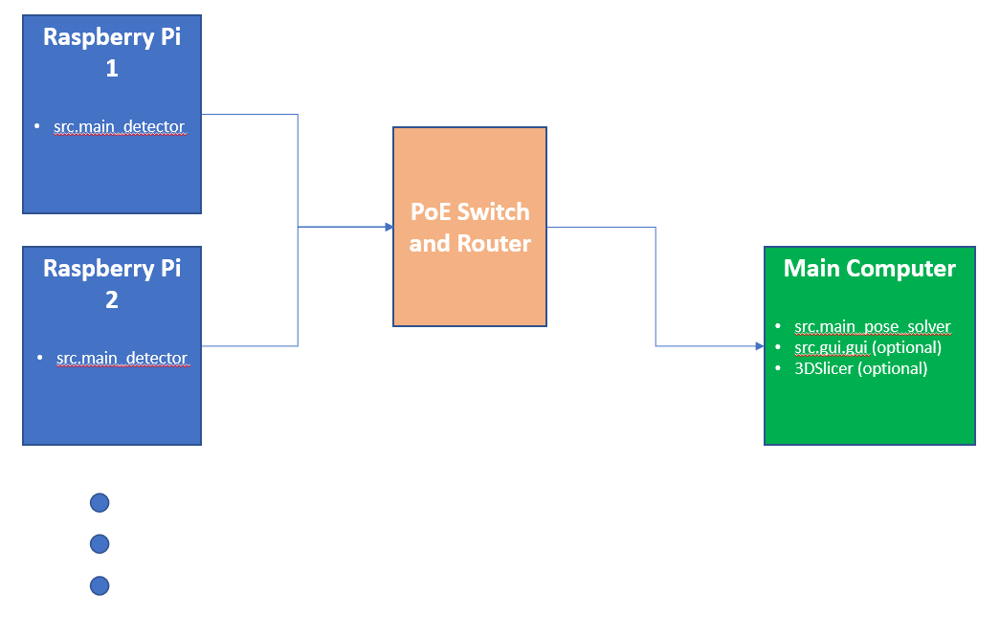

# Hardware Setup

(Let D be the number of detectors you wish you have)

- D x Raspberry Pi 5 - https://www.pishop.ca/product/raspberry-pi-5-8gb/
- D x Raspberry Pi Global Shutter Camera - https://www.pishop.ca/product/raspberry-pi-global-shutter-camera/
- D x Camera Lens - https://www.pishop.ca/product/6mm-wide-angle-lens-for-raspberry-pi-hq-camera-cs/
- D x Raspberry Pi "Drive" - https://www.pishop.ca/product/microsd-card-16-gb-class-10-blank/
- D x Raspberry Pi Camera Cable - https://www.pishop.ca/product/camera-cable-for-raspberry-pi-5 (200 mm, alternate link https://www.canakit.com/raspberry-pi-5-camera-cable.html)
- D x PoE hat for Raspberry Pi 5 - https://www.waveshare.com/poe-hat-f.htm
- D x Gooseneck clamps (choose SCP-BH, SCP-GN18HDB, SCP-TC) - https://snakeclamp.com/collections/camera
- D x Ethernet Cable (yellow) - https://www.cdw.ca/product/tripp-lite-7ft-cat6-gigabit-molded-patch-cable-rj45-m-m-550mhz-24awg-yellow/5991672

- 1 x Switch with PoE support* - https://www.cdw.ca/product/netgear-gs516pp-ethernet-switch/6252835
- 1 x suitable Router*
- 1 x laptop or other computing device on which to run the pose solver
- 2 x Ethernet cables (blue) to connect router, switch, and laptop - https://www.cdw.ca/product/tripp-lite-cat6-gigabit-snagless-molded-patch-cable-rj45-m-m-blue-7ft/622270
- (Optional, but recommended) 1 x Raspberry Pi power supply - https://www.pishop.ca/product/raspberry-pi-27w-usb-c-power-supply-white-us/
- (Optional, but recommended) 1 x Raspberry Pi display cable - https://www.pishop.ca/product/micro-hdmi-to-hdmi-cable-for-pi-4-3ft-black/

* Alternatively, if you do not anticipate needing many detectors, then you can just get a router with sufficient PoE support and skip the switch

Cable colours are just a suggestion to help differentiate them. You can use whatever convention you like, or get all the same colour.

# Router Setup

Coming soon.

# Detector Setup

This system is intended to be used over a LAN connecting Raspberry Pi -based detector(s) and a main computer. The Raspberry Pi's run the ```src.main_detector```, while the main computer runs the ```src.main_pose_solver``` and optionally the ```src.gui.gui``` module. For a diagram, please see below.



To setup the Raspberry Pi -based detectors, 
1. Download the latest OS image (.zip file) under Releases on the main web page of this repository. 
   - Alternatively, run the setup/create_image.sh script on a compatible linux system, which will generate the OS image from scratch
2. Flash the resulting image to a microSD card (or multiple) for use.
   - Plug microSD card into a compatible port, or adapter, on the computer where you downloaded the OS image
   - Use a flashing software, such as (Etcher)[https://etcher.balena.io/], to flash the OS image downloaded in step (1) to the microSD card
   - Once flashing is complete, remove the microSD card from the computer, and plug it into the Raspberry Pi.
   - Power up the Pi by ethernet.
   - To confirm the Pi is working, run a network scan (e.g., (nmap)[https://nmap.org/]) before and after connecting the Pi to the network. Consult the IP address assigned in `Router Setup` to ensure the Pi is connected. 

# Software Environment Setup

This set up is necessary for running the pose solver and GUI on the host machine. After cloning this repository, please see the section that pertains to your operating system below.

### Windows

Please install a recent version of Visual Studio Build Tools: https://visualstudio.microsoft.com/downloads/#build-tools-for-visual-studio-2022

You may need to manually modify the installation and ensure the C++ workload is selected.

```
py -3.11 -m venv venv
cd venv/Scripts
activate
cd ../..
pip install -r requirements.txt
```

### Linux

Install python3.11. If you are on a Debian-based distribution and you cannot find that version of Python, you can try the deadsnakes ppa: https://askubuntu.com/questions/1398568/installing-python-who-is-deadsnakes-and-why-should-i-trust-them

You may need to install additional packages depending on your distribution. The following list is a work in progress and it will become more complete over time:
- libgtk-3-dev
- python3.11
- python3.11-dev

```
py -3.11 -m venv venv
source venv/bin/activate
pip install -r requirements.txt
```

### Troubleshooting

wxPython wheel failure, try: https://wxpython.org/blog/2017-08-17-builds-for-linux-with-pip/index.html


# GUI Usage

On the host machine, with the python virtualenv activated (see platform-specific instructions above), run the ```src.main_pose_solver``` and ```src.gui.gui``` modules - either through command line, or your IDE of choice for debugging. 

Using the GUI, add the IP address and port (8001) of the detector. For the pose solver, the IP address will be localhost and port 8000. To use the pose solver renderer (Windows only), the detector must first be calibrated using a board of markers - as described by https://docs.opencv.org/4.x/da/d13/tutorial_aruco_calibration.html. In the detector panel, with the 'preview image' option checked, capture calibration images of the board at a variety of angles. In the calibrator panel, you can select which ones to use to generate a calibration. Once that is complete, you can set the reference and tracked markers in the pose solver panel, and begin tracking. 
