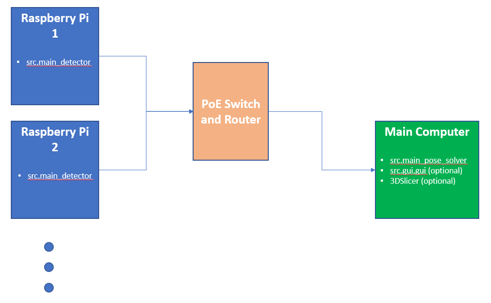

## To Do
- Replace XXXXDetSoftLinkXXXX
- Add images showing how to attach the Raspberry Pi 5 to the Mounting Frame

## Component Overview

MCSTrack uses multiple smart cameras to spatially track moving objects in real-time.
The system contains three custom components: Detectors, Mixers, and a Controller.
They are connected by Ethernet to a PoE (Power over Ethernet) source and a router.
An overview of components is presented in the figure below and then described in more detail.


A **Detector** is a microprocessor that is integrated with a configurable camera.
Camera data is processed by the Detector and converted to a set of intermediate data for later use by the Mixer(s).
Detectors are Raspberry Pi 5 units that each run an image.

A **Mixer** is a computing unit that takes the data from various Detectors and synthesizes the output tracking data.
The Mixer may be either a Raspberry Pi 5 microprocessor, or a Desktop computer.

The **Controller** is the computing unit responsible for coordinating communications between Detectors and Mixers,
allowing a user to access data, and allowing a user to change settings in Detectors and Mixers.
The Controller may be a Linux or Windows device.
It is expected that the Controller will most often be running on a user's computer
alongside other application-specific software

A dedicated Raspberry Pi 5 for the Mixer is optional (hence why it has a dotted outline in the figure above),
but may result in better performance if the computer running the Controller
is also running other computionally-demanding software

The components are connected via Ethernet on a local network.
A PoE switch serves both as a power source and as a communications hub.
The router is required for communications routing and for assigning static IP addresses within the local network.
Ethernet is preferred over a wireless solution due to higher reliability and speed within a local network.

If you have a router capable of supplying PoE to all Detectors with a sufficient number of ports and power budget
(check the documentation from the manufacturer), then a PoE switch may not be needed.

## List of Materials

Let D be the number of Detectors you wish you have.
Let M be the number of dedicated Mixers you wish to have (1 or 0).

- (D + M) x Raspberry Pi 5 - https://www.pishop.ca/product/raspberry-pi-5-8gb/
- (D + M + 1) x Raspberry Pi SD Card (OS Drive) - https://www.pishop.ca/product/microsd-card-16-gb-class-10-blank/
- (D + M) x PoE hat for Raspberry Pi 5 - https://www.waveshare.com/poe-hat-f.htm
- (D + M) x Ethernet Cable - https://www.cdw.ca/product/tripp-lite-7ft-cat6-gigabit-molded-patch-cable-rj45-m-m-550mhz-24awg-yellow/5991672
- D x Raspberry Pi Global Shutter Camera - https://www.pishop.ca/product/raspberry-pi-global-shutter-camera/
- D x Camera Lens - https://www.pishop.ca/product/6mm-wide-angle-lens-for-raspberry-pi-hq-camera-cs/
- D x Raspberry Pi Camera Cable - https://www.pishop.ca/product/camera-cable-for-raspberry-pi-5 (200 mm, alternate link https://www.canakit.com/raspberry-pi-5-camera-cable.html)
- D x Gooseneck clamps (choose SCP-BH, SCP-GN18HDB, SCP-TC) - https://snakeclamp.com/collections/camera
- (D x 8) x Mounting Screws, 4-40 threading, 1/4 inch length, pan head phillips & stainless steel preferred - https://www.digikey.com/en/products/detail/fix-supply/0404MPP188/21635254
- 1 x Raspberry Pi power supply - https://www.pishop.ca/product/raspberry-pi-27w-usb-c-power-supply-white-us/
- 1 x Raspberry Pi display cable - https://www.pishop.ca/product/micro-hdmi-to-hdmi-cable-for-pi-4-3ft-black/
- A means of labelling individual Raspberry Pi 5 units
- 1 x 3D Printer capable of printing in CPE (co-polyester)
- 1 x CPE filament
- 1 x drill
- 1 x #43 drill bit
- 1 x #4-40 UNC screw tap
- 1 x Screw tap wrench
- 1 x Paper Printer (ink may be less reflective and may therefore be preferable over toner)
- White Printer Paper
- White Printer Cardstock
- White Printer Full Page Labels
- 1 x Switch with PoE support* - https://www.cdw.ca/product/netgear-gs516pp-ethernet-switch/6252835
- 1 x suitable Router*
- 1 x laptop or other computing device on which to run the Controller software
- 2 x Ethernet cables to connect router, switch, and laptop - https://www.cdw.ca/product/tripp-lite-cat6-gigabit-snagless-molded-patch-cable-rj45-m-m-blue-7ft/622270v

*Alternatively, if you do not anticipate needing many Detectors, then you may be able to use a router with sufficient PoE support (power budget and ethernet ports)

## Paper Tools

1. Print on cardstock a [Siemens Star](https://en.wikipedia.org/wiki/Siemens_star)
1. Print on paper a [Raspberry Pi 5 - Address list](data/paper/pi_list.pdf)

## SD Card Preparation

1. Gather necessary materials. You will need:
   - Workstation computer (computer other than the one you are preparing)
   - Mouse & Keyboard
   - MicroSD cards, Blank (min. 16 GB)
   - You may also need a MicroSD card adapter for your workstation (if your workstation does not have a MicroSD card slot)
1. On the workstation computer, download and install Raspberry Pi Imager ([link](https://www.raspberrypi.com/software/)).
1. Raspberry Pi OS will be helpful for previewing camera images and focusing lenses. The following steps describe how to flash Raspberry Pi OS to a MicroSD card.
   1. Connect a blank MicroSD card, using an adapter if necessary
   1. Run Raspberry Pi Imager
   1. When asked to select a Device, choose "Raspberry Pi 5" and click "Next"
   1. When asked to select an operating system, select "Raspberry Pi OS (64-bit)" and click "Next"
   1. When asked to select a storage device, choose the blank MicroSD card and click "Next"
   1. When asked to enter customization options, you may enter fields as you see fit
   1. When asked to confirm writing, review the information and proceed through the prompts
   1. When the software indicates that it is safe to eject the MicroSD card, remove it and close Raspberry Pi Imager.
1. The Detector software must be flashed to MicroSD cards, one for each Detector.
   1. Download the latest Detector software image from XXXXDetSoftLinkXXXX
   1. Follow the same procedure as above for flashing Raspberry Pi OS, except when asked to select an operating system, scroll down to select "custom image" and select the image file you just downloaded
1. If you are using a dedicated Mixer on its own Raspberry Pi, then Mixer software must be flashed to a MicroSD card.
   1. Download the latest Mixer software image from XXXXDetSoftLinkXXXX
   1. Follow the same procedure as above for flashing Raspberry Pi OS, except when asked to select an operating system, scroll down to select "custom image" and select the image file you just downloaded

## Updating Raspberry Pi's and Recording MAC Addresses

1. Gather necessary materials.
   - MicroSD Card flashed with Raspberry Pi OS
   - Mouse & Keyboard
   - Display & Suitable cable and/or adapters to connect to a Raspberry Pi 5
   - Raspberry Pi 5 Power Supply
   - All the Raspberry Pi 5 that will become part of the system.
   - A means of labelling individual Raspberry Pi 5 units
   - An Ethernet cable
1. Attach a label to the Raspberry Pi 5 so that it can be uniquely identified.
1. Insert the Raspberry Pi OS MicroSD Card into the Raspberry Pi 5.
1. Connect the Rasperry Pi 5 to a keyboard, mouse, display, Ethernet cable to external Internet, and lastly power
1. Wait for Raspberry Pi 5 to start up and for Raspberry Pi OS to become visible on the display
1. The first time you use your Raspberry Pi OS SD Card, you may want to (or need to) do the following:
   1. Follow first-time boot prompts to enter information such as language and time zone.
   1. Run the following commands to update software packages: `sudo apt update` and then `sudo apt upgrade -y`.
1. Open a command line interface and run the command `ifconfig eth0`. The MAC address will be displayed in the output, look for the line that says `ether: <Mac Address>` and note the MAC address for the specific Raspberry Pi 5 (refer to it by label).
1. Power down the Raspberry Pi 5, and disconnect keyboard, mouse, display, and power.

## Mounting Frame Preparation

1. Gather the necessary materials:
   - 1 x 3D Printer capable of printing in CPE (co-polyester)
   - 1 x CPE filament
   - 1 x drill
   - 1 x #43 drill bit
   - 1 x #4-40 UNC screw tap
   - 1 x Screw tap wrench
1. Download the [Mounting Frame STL File](data/plastic/detector_mount.stl)
1. Use the 3D printer to print one Mounting Frame for each Detector
   - It is recommended to print one Mounting Frame at a time
   - It is recommended to print in CPE due to its toughness and resistance to heat
1. Use a drill with a #43 drill bit to widen the existing holes
   - Ensure that the drill is aimed directly down the existing holes
   - Drill _slowly_ to avoid melting the plastic
   - Drill all the way through the hole
1. Use a tap wrench with #4-40 tap to create threading in each of the holes
   - Ensure that the tap is aimed directly down the hole before starting
   - Once sufficiently deep for threading, begin a repeating pattern of twisting the tap clockwise five times and then counterclockwise twice - this will help to prevent the plastic from blocking thread creation
   - Tap all the way through the hole

## Detector Setup

1. Gather necessary materials.
   - MicroSD Card flashed with Raspberry Pi OS
   - Mouse & Keyboard
   - Display & Suitable cable and/or adapters to connect to a Raspberry Pi 5
   - Raspberry Pi 5 Power Supply
   - Each Detector will additionally need:
      - Raspberry Pi 5
      - Raspberry Pi Global Shutter Camera
      - Raspberry Pi Camera Cable
      - Camera Lens
      - PoE HAT for Raspberry Pi 5
      - Mounting Frame prepared as per instructions above
      - MicroSD Card flashed with Detector software
1. Install the PoE HAT on the Raspberry Pi 5 as per product instructions
1. Install the Camera Lens on the Raspberry Pi 5 Global Shutter Camera
1. Connect the Raspberry Pi 5 to the Mounting Frame
1. Connect the Raspberry Pi 5 Global Shutter Camera to the Mounting Frame
1. Connect the Raspberry Pi 5 to the Raspberry Pi 5 Global Shutter Camera using the Raspberry Pi Camera Cable
1. Focus the Camera Lens
   1. Place the assembled Detector such that the camera is directed toward a full-page Siemens Star, and is at a distance similar to that of markers in the intended use case
   1. Insert the Raspberry Pi OS MicroSD Card into the Raspberry Pi 5.
   1. Connect the Rasperry Pi 5 to a keyboard, mouse, display, and lastly power
   1. Wait for Raspberry Pi 5 to start up and for Raspberry Pi OS to become visible on the display
   1. Open a command line interface and run the command `rpicam-hello -t 1000000`. This is expected to show a live camera image, though it will likely be out of focus.
   1. Turn the shutter ring all the way open
   1. Turn the focus ring such that the star pattern is in maximal focus (lines and boundaries appear as sharp as possible). Close the preview window when done.
   1. If you do not already have it, use the command `ifconfig` to find the Ethernet MAC address.
   1. Power down the Raspberry Pi 5, and disconnect keyboard, mouse, display, and power.
1. Insert the MicroSD Card flashed with the Detector software

## Mixer Setup

### Dedicated Raspberry Pi

These instructions apply only if you use a dedicated Mixer on its own Raspberry Pi 5.

1. Gather necessary materials.
   - Raspberry Pi 5
   - PoE HAT for Raspberry Pi 5
   - MicroSD Card flashed with Mixer software
1. Install the PoE HAT on the Raspberry Pi 5 as per product instructions
1. Insert the MicroSD Card flashed with the Mixer software

### Other computer (Windows)

1. Clone the MCSTrack repository
1. Install dependencies via the following commands:
   ```
   python3 -m venv .venv
   cd .venv/Scripts
   activate
   cd ../..
   pip install .[component]
   ```
1. To run:
   ```
   cd .venv/Scripts
   activate
   cd ../..
   python -m src.main_detector
   ```

## Controller Setup

1. Clone the MCSTrack repository
1. Install dependencies via the following commands:
   ```
   python3 -m venv .venv
   cd .venv/Scripts
   activate
   cd ../..
   pip install .[gui]
   ```
1. To run:
   ```
   cd .venv/Scripts
   activate
   cd ../..
   python -m src.gui.gui
   ```

## Router and PoE Setup

1. Gather materials. You will need:
   - PoE Switch
   - Router
   - Ethernet cables supporting PoE
   - A list of Ethernet MAC addresses for each Raspberry Pi in the system
1. Place the PoE Switch as desired, and connect to power with an appropriate power cable or AC adapter.
1. Place the router as desired, connect to the PoE switch with an Ethernet cable, and connect to power with an appropriate cable and AC adapter.
1. Use your workstation to configure the router (note that the names of settings or screenshots may be different depending on the router model - consult your router's documentation)
   1. If your workstation is on any network, first disconnect from that network. If connected over Ethernet, physically disconnect.
   1. Connect your workstation to the PoE Switch with an Ethernet cable.
   1. Open an Internet browser on your workstation and navigate to your router's configuration page.
   1. For each Raspberry Pi 5, reserve a dedicated IP Address based on MAC Address
      - For example, in a system with two detectors and one Mixer, the Detectors may have IP addresses `192.168.0.101` and `192.168.0.102`, and the Mixer `192.168.0.100`
   1. Configure the router to deny external attempts to connect to any of the Raspberry Pi's.

## Usage

On the host machine, with the python virtualenv activated (see platform-specific instructions), run the ```src.gui.gui``` module. 

Using the GUI, add the IP address and port (8001) of the detector. For the pose solver, the IP address will be localhost and port 8000. To use the pose solver renderer (Windows only), the detector must first be calibrated using a board of markers - as described by https://docs.opencv.org/4.x/da/d13/tutorial_aruco_calibration.html. In the detector panel, with the 'preview image' option checked, capture calibration images of the board at a variety of angles. In the calibrator panel, you can select which ones to use to generate a calibration. Once that is complete, you can set the reference and tracked markers in the pose solver panel, and begin tracking. 

# Developer Setup

## Custom Detector Image

This system is intended to be used over a LAN connecting Raspberry Pi -based detector(s) and a main computer. The Raspberry Pi's run the ```src.main_detector```, while the main computer runs the ```src.main_pose_solver``` and optionally the ```src.gui.gui``` module. For a diagram, please see below.



To setup the Raspberry Pi -based detectors, 
1. Run the setup/create_image.sh script on a compatible linux system, which will generate the OS image from scratch
2. Flash the resulting image to a microSD card (or multiple) for use.
   - Plug microSD card into a compatible port, or adapter, on the computer where you downloaded the OS image
   - Use a flashing software, such as (Etcher)[https://etcher.balena.io/], to flash the OS image downloaded in step (1) to the microSD card
   - Once flashing is complete, remove the microSD card from the computer, and plug it into the Raspberry Pi.
   - Power up the Pi by ethernet.
   - To confirm the Pi is working, run a network scan (e.g., (nmap)[https://nmap.org/]) before and after connecting the Pi to the network. Consult the IP address assigned in `Router Setup` to ensure the Pi is connected. 

## Software Environment Setup

This set up is necessary for running the pose solver and GUI on the host machine. After cloning this repository, please see the section that pertains to your operating system below.

### Windows

Please install a recent version of Visual Studio Build Tools: https://visualstudio.microsoft.com/downloads/#build-tools-for-visual-studio-2022

You may need to manually modify the installation and ensure the C++ workload is selected.

```
py -3.11 -m venv .venv
cd venv/Scripts
activate
cd ../..
pip install .[gui,component]
```

### Linux

Install python3.11. If you are on a Debian-based distribution and you cannot find that version of Python, you can try the deadsnakes ppa: https://askubuntu.com/questions/1398568/installing-python-who-is-deadsnakes-and-why-should-i-trust-them

You may need to install additional packages depending on your distribution. The following list is a work in progress and it will become more complete over time:
- libgtk-3-dev
- python3.11
- python3.11-dev

```
py -3.11 -m venv .venv
source venv/bin/activate
pip install .[gui,component]
```

### Troubleshooting

wxPython wheel failure, try: https://wxpython.org/blog/2017-08-17-builds-for-linux-with-pip/index.html
